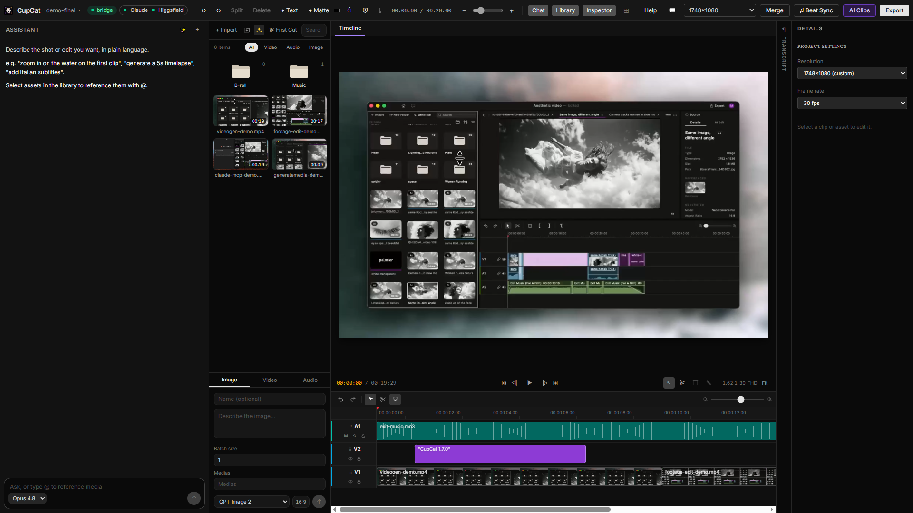

<div align="center">


# 🧁 CupCat

**The free, local, AI-native video editor for Windows.**

Claude edits your timeline. Everything runs on your machine. No credits, no watermark, no account.

[](LICENSE)
[]()
[](../../releases/latest)
[]()

</div>

<div align="center">
  
</div>

---

CupCat is a real timeline video editor where an **AI agent is a first-class editor**. You describe
the edit in plain language — *"cut this 30-minute interview to a highlight reel, remove the
filler, add Italian captions, make it 9:16"* — and Claude does it directly on your timeline,
using ~100 real editing tools. Almost everything runs **offline on your PC**: transcription,
captions, dubbing, stem separation, reframing, slow-mo, motion tracking, exports.

The whole point: an AI editor that is **free, local, and yours**. No credit meters, no
subscription gates, no cloud upload of your footage, no watermark, no account. Just a fast editor
with an agent that actually operates the timeline.

## Highlights

- 🎬 **The agent edits the timeline** — ~100 real tools (cut, trim, ripple, keyframe, caption,
  mask, color, multicam, compound, export prep) driven by plain language.
- 🔒 **Local-first & private** — your media never leaves your machine; the AI toolbox runs on-device.
- 💸 **Zero credits** — every local feature is free and unlimited; optional generation uses your own account.
- 🪟 **Windows-native** — a single self-contained installer, no preinstalls, no Python.
- 🧩 **Open source (GPLv3).**

## Two ways to drive the AI

1. **In-app chat** — talk to Claude inside the editor (Opus 4.8 / Fable 5 / Sonnet / Haiku), with
   `@`-mentions of your media, an interruptible run, and a live build-log of every tool call.
2. **Claude Code / Claude Desktop over MCP** — CupCat exposes your open project as a local MCP
   server. Point any MCP client at it and edit your timeline from your own Claude:

   ```
   claude mcp add --transport http cupcat http://127.0.0.1:19789/mcp
   ```

Both paths share the exact same tool surface — editing by chatting and editing over MCP are the
same engine.

## What it can do

**Agentic editing** — describe an edit, get it done. First-cut assembly from a folder of footage,
transcript-based text editing (delete words → the video ripples), one-click filler removal
("um / uh / cioè …"), long→short clipping into vertical shorts with karaoke captions, hooks and
titles, a Ctrl+K command palette that falls back to the assistant.

**Local AI toolbox — free, offline, no credits:**

| Tool | What it does | Engine (local) |
|---|---|---|
| `auto_rough_cut` | Folder of footage → assembled first cut + music bed | ffmpeg scene analysis |
| Transcript panel | Edit the video by editing its text; one-click filler removal | Whisper (on-device) |
| `auto_clips` | Long video → N vertical shorts w/ captions, hooks, titles | Whisper + Claude |
| `auto_reframe` | Reframe to 9:16/1:1 by tracking the subject per shot | ffmpeg saliency |
| `separate_stems` | Split audio into **voice + music** | sherpa-onnx spleeter |
| `smooth_slowmo` | Fluid, motion-interpolated slow motion | ffmpeg minterpolate |
| `track_motion` | Pin text/stickers to a moving subject | template matching |
| `dub_timeline` | Transcribe → translate → speak → time-fit a dub track | Whisper + Piper TTS |
| `add_captions` / `translate_captions` | Karaoke captions + translations | Whisper + Claude |
| `add_motion_graphic` / `make_transition` | Claude writes an animated HTML/CSS overlay → alpha video | Edge headless + VP9 |
| `identify_speakers` | Speaker diarization | sherpa-onnx |
| Semantic `search_media` | Find clips by name, generation prompt, or what's spoken | token index |

**Generative media** — when you *want* to generate (never required, never metered by us): the
agent calls **Higgsfield** through your own account (video, images, audio, upscaling, AI reframe,
background removal).

**Pro editing** — multicam, compound clips (live nesting), adjustment layers, bezier keyframe
curves, pen masks with feather, chroma key, HDR (Dolby Vision decode-once → HLG HEVC export),
frame-exact lossless smart-cut, beat sync, markers, rich text, custom keyboard shortcuts,
screen/webcam recorder, URL import, project versioning.

**Export** — H.264 · H.265 · **AV1 (10-bit)** · HDR HEVC · ProRes · FCPXML / FCP7 XML for pro NLEs
· lossless stream-copy. Exports are always **user-initiated** — the agent prepares the edit and
hands you the Export button; it never renders on your behalf.

## Install

**Just want to use it:** download the installer from the
[**latest release**](../../releases/latest) — `CupCat_<version>_x64-setup.exe` — and run it. It's a
self-contained Windows app; every local engine (ffmpeg, Whisper, Piper, sherpa-onnx) is bundled.
No preinstalls, no Python, no credits.

To use the in-app assistant or MCP, sign in to **Claude Code** on the same machine. To generate
media, sign in to **Higgsfield** (`higgsfield auth login`).

## How it works

```
Claude Code / Desktop ──MCP (http 127.0.0.1:19789/mcp)──▶  CupCat bridge (bun, compiled)
In-app chat ───────────────────────────────────────────┤   ├─ ~100 timeline + media tools
                                                        │   ├─ local AI: Whisper · Piper · sherpa-onnx · ffmpeg
                                                        │   └─ Higgsfield CLI (generate / upscale, your account)
                                                        │ WebSocket (live state)
                                                        ▼
                              CupCat editor (React + Vite) ── @cupcat/editor-core
                              timeline · preview · media library · inspector · transcript
```

- **`packages/editor-core`** — pure-TypeScript timeline model: commands, undo/redo, keyframes,
  selectors. Framework-free and unit-tested.
- **`apps/web`** — the editor UI (React 19 + Vite + Tailwind).
- **`apps/bridge`** — the local process: hosts the MCP server + WebSocket, runs the AI toolbox,
  drives Higgsfield + ffmpeg. Compiles to a single sidecar binary.
- **`apps/desktop`** — the Tauri shell that bundles the bridge, the web UI, and every local engine
  into one NSIS installer.

## Build from source

Requires **[Bun](https://bun.sh)**, **Rust** (for the Tauri shell), and the Windows build tools.

```bash
bun install
bun run typecheck          # editor-core + bridge + web
bun run build:core         # the shared model
bun --filter @cupcat/web build

# dev: run the web editor + bridge (uses port 19789)
bun run web
bun run bridge
```

The bundled AI engines (ffmpeg, Whisper/GGML models, Piper voices, sherpa-onnx models) live under
`apps/desktop/src-tauri/sidecars/` and are **git-ignored** because of their size — the shipped
installer already contains them. To produce the installer:

```bash
cd apps/desktop/src-tauri
bunx @tauri-apps/cli build      # → target/release/bundle/nsis/CupCat_<version>_x64-setup.exe
```

## Roadmap

See [`ROADMAP.md`](ROADMAP.md) for the full development history through v1.7.0.

## License

**GPL-3.0-or-later** — see [`LICENSE`](LICENSE) and [`NOTICE.md`](NOTICE.md). Generative AI is
provided by **Higgsfield** via its CLI, under your own account — not bundled.

<div align="center">
<sub>Made to prove an AI editor can be free, local, and yours.</sub>
</div>
